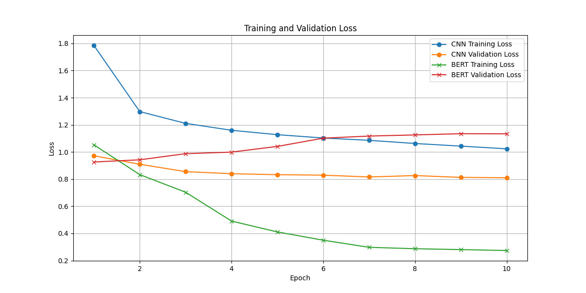
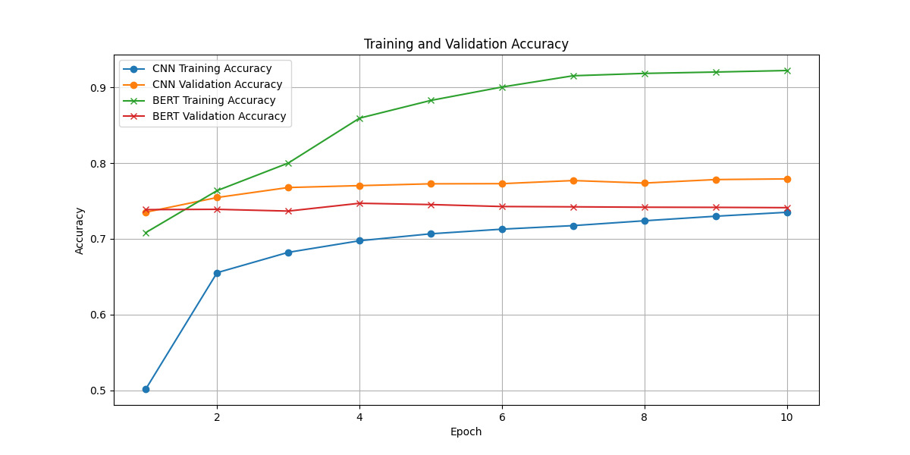

#  SEMANTIC: Systematic Evaluation of Multi-class Article News-Text Identification and Categorization
SEMANTIC is a project focused on automating the multi-class classification of news articles using machine learning. By leveraging both traditional models and advanced NLP techniques like CNNs and BERT, it addresses key challenges such as class imbalance and varied article lengths. Using an IAB-categorized dataset, SEMANTIC aims to improve contextual understanding and accurate categorization of diverse news content.

## Project Overview
This project, SEMANTIC, focuses on the systematic evaluation of multi-class classification models for categorizing news articles into IAB 
(Interactive Advertising Bureau) categories. We explore the use of traditional and deep learning models, emphasizing the challenges of class imbalance and variable-length articles, with a dataset categorized under the IAB taxonomy.

## Dataset
Semantic leverages a labeled dataset from HuggingFace containing IAB-categorized news articles, which provides a real-world representation of news content across various categories. The dataset contains 26 different categories ranging over a variety of content, like "academic interests", "sports", "video games", and more. The dataset presents challenges due to:

Available at: 
<a href="https://huggingface.co/datasets/shishir-dwi/News-Article-Categorization_IAB">
          <button>News Article IAB HuggingFace link</button></a> 

1. **Class Imbalance**: Some categories have significantly fewer articles.
2. **Variable Article Lengths**: Articles range from a few hundred to thousands of characters.

Data is split into Train, Validation, Test in  45%, 35%, 20% respectively.


## Getting Started

1. **Clone or Download the Repo**:
    - You can clone this repository using the following command:
    ```bash
    git clone https://github.com/Samhita-kolluri/SEMANTIC.git
    ```
    - Or download it as a ZIP file from the GitHub page.

2. **Installing Dependencies**:
    Since this project runs on Google Colab, you don't need a `requirements.txt` file. Although Colab includes most libraries, you might need to install specific ones. You can do so by running:
    ```python
    !pip install transformers==4.33.2
    !pip install tensorflow
    !pip install imblearn
    !pip install wordcloud
    ```

3. **Running on Google Colab**:
    - Open the notebooks in Google Colab:
        * <a href="https://github.com/Samhita-kolluri/SEMANTIC/blob/main/baseline_model.ipynb">
          <button>Logistic Regression with TF-IDF Model</button></a>
        * <a href="https://github.com/Samhita-kolluri/SEMANTIC/blob/main/cnn_model.ipynb">
          <button>CNN with Word2Vec embeddings Model</button></a>
        * <a href="https://github.com/Samhita-kolluri/SEMANTIC/blob/main/bert_model.ipynb">
          <button>Bert Model</button></a>


3. **TPU Runtime**:
    - To utilize the TPU, select the following runtime type in Colab:
      - Runtime → Change runtime type → Hardware accelerator → v2-8 TPU

4. **Dataset**:
    - The dataset is available on HuggingFace you can download it locally, and upload it to the Colab environment before running the notebooks.

## TPU Setup (Optional)
To use TPU in Colab for faster training, select `TPU` under the hardware accelerator option.

You can also initialize TPU using the following code:

```python
try:
    resolver = tf.distribute.cluster_resolver.TPUClusterResolver()  # Detecting TPUs
    tf.config.experimental_connect_to_cluster(resolver)
    tf.tpu.experimental.initialize_tpu_system(resolver)
    strategy = tf.distribute.TPUStrategy(resolver)
    print("TPU initialized successfully.")
except Exception as e:
    print(f"Error initializing TPU: {e}")
```

## Usage

- Clone this repository to your local machine if you wish to run the models locally (or on any system outside of Colab). Make sure to update the file path.
- For Colab, simply open the respective notebooks and follow the instructions within them.
- Upload the dataset to Colab and make sure you run each model notebook sequentially.

## Notes

- Ensure you're using the correct runtime type (TPU) for optimal performance.
- The notebooks are set up to run with the dataset being uploaded locally to Colab. Make sure you follow the instructions in each notebook to upload your dataset.

## Methodology
The core task of S.E.M.A.N.T.I.C is multi-class classification of news articles. This involves:
* Preparing the data and accounting for the class imbalance.
* Building a Logistic Regression, CNN, and BERT-based classifier.
* Assigning each article to one or more IAB categories.
* Handling a diverse range of topics and writing styles.

## Model Overview
SEMANTIC compares three models:
### 1. Baseline model - Logistic Regression with TF-IDF:
A simple yet effective approach for text classification.
### 2. Intermediate - CNN with Word2Vec embeddings:
Combines word embeddings with convolutional layers to capture local patterns in text.
### 3. Advanced - BERT:
Utilizes transformer architecture for contextual understanding of text.

### Model Selection - CNN with Word2Vec
* CNN with Word2Vec is chosen as the primary model after evalulating the 3 models.
* This architecture allows the model to effectively capture local patterns in text while considering the semantic relationships between words.
* It shows significant improvement from the initial to final accuracy, indicating effective learning.

## Results

<p align="center">
  
  
</p>

### Key takeaways
* The CNN with Word2Vec model demonstrates faster learning with higher training and validation accuracy, suggesting that it generalizes well on the validation set.
* The BERT model has a slower rate of improvement, especially in validation Accuracy 

## Future Work
* Combine multiple models to improve overall performance.
* Investigate advanced techniques for imbalanced data.
* Implementing a transformer-based decoder or advanced techniques to enhance model transparency.
* Optimize model architecture and training parameters for better performance.
* Integrate news-specific features or pre-processing techniques to enhance classification accuracy.

By addressing these limitations and pursuing these future directions, the S.E.M.A.N.T.I.C aims to create 
an even more robust and accurate news article classification system